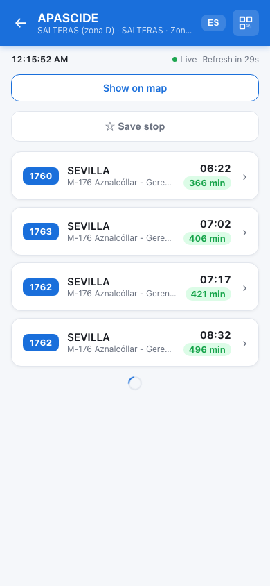
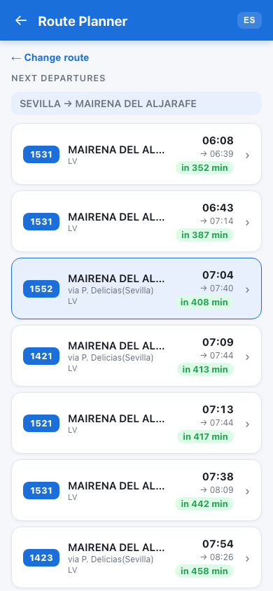
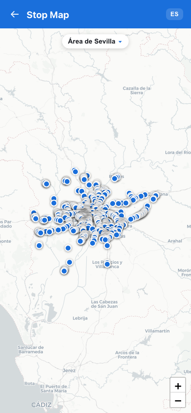
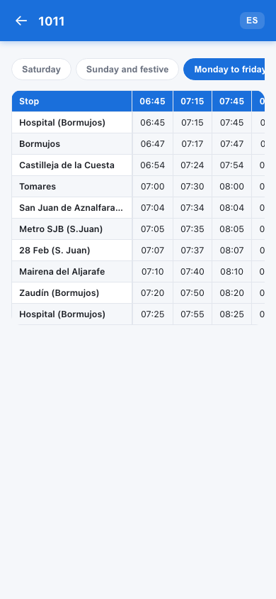

# CTAN Bus Tracker

A progressive web app for real-time bus departures, route planning, journey planning, timetables, and an interactive stop map across the nine public transport consortiums of Andalusia, Spain.

**[🚌 Live demo → hendrikbgr.github.io/andalusia-public-transport-app/home.html](https://hendrikbgr.github.io/andalusia-public-transport-app/home.html)**

Built with vanilla JavaScript, Leaflet.js, and the public [CTAN API](https://api.ctan.es).

---

## Screenshots

| Home | Live Departures | Route Planner |
|------|----------------|---------------|
|  |  |  |

| Stop Map | Route Polyline | Full Timetable |
|----------|---------------|----------------|
|  |  |  |

---

## Features

| Page | Description |
|------|-------------|
| **Home** (`home.html`) | Dashboard with quick access to all features; shows saved stops for one-tap access |
| **Live Departures** (`station.html`) | Real-time bus board, auto-refreshes every 30 s without flicker; save stops, share via QR code, show stop on map |
| **Route Detail** (`route.html`) | All stops on a line with direction tabs; service disruption alerts; links to full timetable and polyline map |
| **Route Planner** (`planner.html`) | Find direct buses between two towns; Today / Tomorrow / Pick date selector; full day timetable below results |
| **Journey Planner** (`journey.html`) | Multi-leg journey planning with transfers; out-of-network fallback; per-leg map links |
| **Line Timetables** (`linetimetable.html`) | Search any line by code or name, then view its complete scheduled timetable |
| **Full Timetable** (`timetable.html`) | Complete scrollable timetable grid for any line; tabs for each day type (weekday / Saturday / Sunday) |
| **Stop Map** (`map.html`) | Interactive Leaflet map of all stops in a region; tap a stop for departures; draws route polylines |
| **Settings** (`settings.html`) | Language, default region, default date mode, saved stops management, cache clear, install guide |

### Additional features
- 🌍 **English / Spanish** language toggle, persisted via cookie
- ⭐ **Saved stops** — star any stop from its departures page; pinned to the top of the home screen
- 📍 **User location dot** — pulsing blue dot on the map that tracks your position
- 📲 **PWA** — installable on iOS/Android; offline shell cache via service worker
- 🗺️ **Route polyline** — draw a line's full route on the map with only its stops highlighted; toggle all stops on/off
- ⚠️ **Disruption alerts** — expandable alert cards on route pages when a line has active notices
- 🎉 **Update confetti** — confetti burst after accepting an app update via the update banner

---

## Project structure

```
├── home.html              # Home dashboard
├── index.html             # Stop selector (region → stop)
├── station.html           # Live departures board
├── route.html             # Route stops detail
├── planner.html           # Route planner (direct, town-to-town)
├── journey.html           # Journey planner (multi-leg with transfers)
├── linetimetable.html     # Line search + timetable
├── timetable.html         # Full line timetable grid
├── map.html               # Interactive Leaflet stop map
├── settings.html          # App settings
│
├── manifest.json          # PWA manifest
├── sw.js                  # Service worker (offline shell)
│
├── src/
│   ├── style.css          # All styles
│   └── js/
│       ├── i18n.js        # Translations, cookies, language helpers
│       ├── app.js         # Stop selector logic
│       ├── home.js        # Home page logic + SW update banner + confetti
│       ├── station.js     # Live departures + auto-refresh + QR + save
│       ├── route.js       # Route stops + direction tabs + disruptions
│       ├── planner.js     # Route planner + date picker + direct connections
│       ├── journey.js     # Journey planner + transfers + out-of-network
│       ├── linetimetable.js # Line search + timetable entry point
│       ├── map.js         # Leaflet map + polyline + location dot
│       ├── timetable.js   # Full timetable grid
│       └── settings.js    # Settings page logic
│
├── tests/
│   ├── conftest.py        # Shared fixtures (server, browser, constants)
│   ├── test_api.py        # Live API contract tests
│   ├── test_home.py       # Home page UI tests
│   ├── test_navigation.py # Stop selector + back-button chain
│   ├── test_timetable.py  # Station departures page tests
│   ├── test_planner.py    # Route planner UI tests
│   └── test_map.py        # Stop map UI tests
│
├── .github/workflows/
│   ├── ci.yml             # Run tests on push + PRs
│   ├── deploy.yml         # Deploy to GitHub Pages on push to main
│   ├── bump-version.yml   # Auto-bump version badge, sw.js cache name, and ?v= query strings
│   └── sw-cache-check.yml # Warn on PR if sw.js wasn't updated alongside HTML/JS changes
│
└── docs/
    ├── screenshots/       # README screenshots
    └── api.md             # CTAN API endpoint reference
```

---

## Running locally

No build step, no bundler, no framework — just open the HTML files:

```bash
python3 -m http.server 8787
# then open http://localhost:8787/home.html
```

---

## Running tests

```bash
# Install deps
pip install -r requirements.txt
python -m playwright install chromium --with-deps

# Run all tests
pytest tests/ -v

# Run a specific suite
pytest tests/test_api.py -v        # CTAN API contract
pytest tests/test_home.py -v       # Home page
pytest tests/test_navigation.py -v # Stop selector + back buttons
pytest tests/test_planner.py -v    # Route planner
pytest tests/test_map.py -v        # Stop map

# Skip tests that hit the live API
pytest tests/ -m "not network" -v
```

Tests use **pytest** + **Playwright** (headless Chromium).

---

## Versioning

Version bumping is fully automated — never update version numbers manually:

- The **app version badge** (`vN` in `home.html`) and **SW cache name** (`ctan-shell-vN` in `sw.js`) are bumped automatically by the `bump-version.yml` workflow on every push to `main`
- The **per-file `?v=N` cache-busting query strings** on `<script>` and `<link>` tags are also bumped automatically for any JS or CSS file changed in the same commit

---

## External dependencies

| Library | Version | Usage |
|---------|---------|-------|
| [Leaflet.js](https://leafletjs.com) | 1.9.4 | Interactive map |
| [CartoDB light tiles](https://carto.com) | — | Map tile layer |
| [QRCode.js](https://github.com/davidshimjs/qrcodejs) | 1.0.0 | QR code for stop URL |

All loaded from CDN — no `npm install` required.

---

## API

All data comes from the public CTAN API:

```
https://api.ctan.es/v1/Consorcios
```

See the [wiki API reference](https://github.com/hendrikbgr/andalusia-public-transport-app/wiki/API-Reference) for a full endpoint reference.

---

## Wiki

Full developer documentation: **[github.com/hendrikbgr/andalusia-public-transport-app/wiki](https://github.com/hendrikbgr/andalusia-public-transport-app/wiki)**

Covers architecture, all pages, JS modules, API, URL parameters, service worker, testing, and CI/CD.

---

## Browser support

Modern browsers with ES2020 support. Tested in Chrome and Safari on iOS / macOS.
